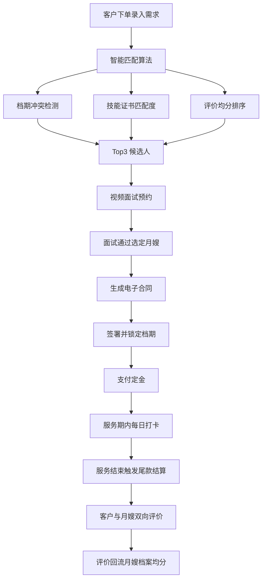
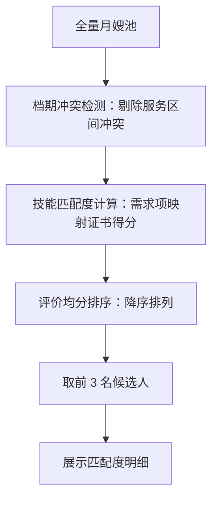

# 月嫂中介公司管理面板 PRD

## 1. 产品概述

本项目为月嫂中介公司打造一套一体化管理面板，覆盖月嫂档案、客户下单、智能匹配、合同支付、服务过程全链路业务。面向中介公司管理人员（含月嫂端签到场景），解决人工撮合效率低、档期易冲突、合同结算难追踪等痛点，目标是让一次"下单→匹配→签约→服务→结算"的业务流可在单一系统中高效闭环。

- 目标用户：月嫂中介公司运营/管理人员（主），月嫂本人（签到场景，次）
- 市场价值：用智能匹配算法将原本数小时的人工撮合压缩到秒级，并沉淀全流程数据资产

## 2. 核心功能

### 2.1 用户角色

| 角色 | 接入方式 | 核心权限 |
|------|----------|----------|
| 管理人员 | 账号登录 | 月嫂档案管理、客户下单、智能匹配、合同支付、服务监督、双向评价查看 |
| 月嫂 | 签到入口 | 每日打卡签到、查看自己的档期与服务进度 |

> 本期以管理人员视角为主，月嫂端通过"签到面板"轻量接入，不做完整权限体系。

### 2.2 功能模块

1. **仪表盘**：核心指标概览、待办事项、档期冲突预警、近期订单
2. **月嫂档案管理**：档案列表（筛选/排序/增删改查）、档案详情（证书、评价均分、档期）
3. **客户下单系统**：客户信息录入、预产期选择、服务天数选择、需求勾选、表单校验
4. **智能匹配系统**：自动筛选算法、Top3 候选人展示、视频面试预约
5. **合同与支付管理**：电子合同生成签署、定金支付、尾款结算
6. **服务过程管理**：每日打卡签到、服务进度跟踪、服务结束互评

### 2.3 页面详情

| 页面名称 | 模块名称 | 功能描述 |
|----------|----------|----------|
| 仪表盘 `/dashboard` | 指标卡片 | 在册月嫂数、进行中服务数、待匹配订单数、本月营收 |
| 仪表盘 `/dashboard` | 档期冲突预警 | 列出近 30 天档期重叠的月嫂与订单 |
| 仪表盘 `/dashboard` | 待办事项 | 待匹配、待签约、待结算、待评价四类待办 |
| 月嫂档案列表 `/matrons` | 筛选与排序 | 按证书、籍贯、从业年限、评价均分筛选与排序 |
| 月嫂档案列表 `/matrons` | 档案卡片/表格 | 展示头像、姓名、年龄、籍贯、从业年限、证书标签、评价均分 |
| 月嫂档案列表 `/matrons` | 增删改查 | 新增、编辑、删除（二次确认）、查看详情 |
| 月嫂档案详情 `/matrons/:id` | 基本信息卡 | 完整字段展示与编辑入口 |
| 月嫂档案详情 `/matrons/:id` | 持证情况 | 多选证书管理（高级母婴护理师证、催乳师证、营养师证、小儿推拿证） |
| 月嫂档案详情 `/matrons/:id` | 客户评价 | 自动计算均分、评价详情列表、评分分布 |
| 月嫂档案详情 `/matrons/:id` | 档期日历 | 已占用档期可视化展示 |
| 客户下单 `/orders/new` | 客户信息表单 | 姓名、电话、预产期选择 |
| 客户下单 `/orders/new` | 服务天数选择器 | 26天/42天/52天/78天 单选 |
| 客户下单 `/orders/new` | 需求勾选 | 通乳、月子餐制作、夜间带睡、家务兼做 多选 |
| 客户下单 `/orders/new` | 表单校验 | 关键字段非空、电话格式、预产期合理性校验 |
| 订单列表 `/orders` | 订单表格 | 订单号、客户、服务天数、状态、匹配状态、操作 |
| 智能匹配 `/matching/:orderId` | 匹配算法说明 | 展示三大匹配逻辑的执行过程 |
| 智能匹配 `/matching/:orderId` | Top3 候选人 | 候选人卡片含匹配度、档期、证书命中、评价分 |
| 智能匹配 `/matching/:orderId` | 视频面试预约 | 选择候选月嫂→选面试时间→生成预约 |
| 合同管理 `/contracts` | 合同列表 | 合同号、关联订单、签约状态、金额 |
| 合同详情 `/contracts/:id` | 电子合同 | 合同条款生成、签署操作、签署后锁定月嫂档期 |
| 支付管理 `/payments` | 支付列表 | 定金/尾款状态、支付方式、金额 |
| 支付管理 `/payments` | 定金支付 | 选择支付方式（微信/支付宝/银行转账/现金）、确认支付 |
| 支付管理 `/payments` | 尾款结算 | 服务结束后触发结算流程 |
| 服务进度 `/service/:orderId` | 进度跟踪 | 服务剩余天数、完成进度环、每日打卡时间线 |
| 服务进度 `/service/:orderId` | 每日打卡 | 月嫂端签到、管理人员确认 |
| 服务进度 `/service/:orderId` | 互评系统 | 服务结束后客户与月嫂双向评价 |
| 签到面板 `/checkin` | 月嫂签到 | 月嫂选择自己→选择服务订单→签到打卡 |

## 3. 核心流程

**主业务流（下单→匹配→签约→服务→结算→评价）**：

1. 管理人员录入客户信息与需求，选择服务天数，生成订单
2. 系统执行智能匹配：先做档期冲突检测剔除不可用月嫂，再按需求计算技能证书匹配度，最后按客户评价均分排序，取 Top3 候选人
3. 客户对候选人发起视频面试预约，面试通过后选定一名月嫂
4. 系统生成电子合同，双方签署后自动锁定该月嫂对应档期
5. 客户支付定金，合同进入待服务状态
6. 服务期内月嫂每日打卡签到，管理人员监督；系统实时计算剩余天数
7. 服务结束后触发尾款结算流程
8. 客户与月嫂双向评价，评价分数自动回流到月嫂档案均分

**智能匹配算法流程**：

## 4. 用户界面设计

### 4.1 设计风格

**整体方向：温暖庇护所（Soft Sanctuary）**——专业、温暖、精致的管理面板，传递母婴护理行业的温度感，同时保持数据型工具的高效。

- **主色**：深森绿 `#1F4E3D`（沉稳、可信、寓意照护与生长）
- **辅助色**：暖陶土 `#C8553D`（点缀强调，用于关键操作与警示）
- **背景**：象牙白 `#FAF7F2`（柔和、护眼，区别于纯白冷感）
- **表面**：奶白 `#FFFFFF` / 浅米 `#F2EDE4`（卡片与分区）
- **文字**：墨绿黑 `#1A2B25`（主文）/ 暖灰 `#6B6258`（次文）
- **字体**：标题使用 `Noto Serif SC`（思源宋体，端庄优雅），正文使用 `Noto Sans SC`（思源黑体，清晰易读）
- **按钮风格**：圆角矩形（8px），主按钮深森绿实底带微阴影，次按钮描边
- **布局风格**：左侧固定侧边栏导航 + 右侧内容区，卡片式分区，充足留白
- **图标风格**：Material Icons 圆润线条，配合柔和色彩

### 4.2 页面设计概览

| 页面名称 | 模块名称 | UI 元素 |
|----------|----------|--------|
| 仪表盘 | 指标卡片 | 4 列卡片，大数字+小标签，悬浮微动效 |
| 仪表盘 | 预警与待办 | 双栏，冲突红色标记，待办按类型分组 |
| 月嫂档案列表 | 筛选区 | 折叠式多条件筛选栏，顶部排序下拉 |
| 月嫂档案列表 | 表格/卡片切换 | 视图切换，证书标签彩色 Chip |
| 月嫂档案详情 | 评价均分 | 大号评分数字 + 星级 + 分布柱状图 |
| 客户下单 | 表单分组 | 卡片分组，步骤指示器，服务天数大按钮选择 |
| 智能匹配 | 候选人卡片 | 匹配度环形进度 + 证书命中标签 + 评分 |
| 合同详情 | 电子合同 | 文档式排版，签署区高亮 |
| 服务进度 | 进度环 | 圆环进度可视化 + 打卡时间线 |
| 签到面板 | 签到卡片 | 大号签到按钮，今日状态高亮 |

### 4.3 响应式

- 桌面优先（1280px+ 完整体验）
- 平板（768-1280px）侧边栏收为图标，内容区自适应
- 触摸优化：按钮最小 44px 触达区，表格横向滚动

## 5. 非功能需求

- **Mock 数据服务**：模拟 API 请求与响应，含网络延迟（300-800ms）与加载态
- **状态管理**：Context API + 自定义 Hooks 管理全局数据（月嫂、订单、合同等）
- **表单验证**：客户端校验，关键字段必填，错误提示就近展示
- **加载与错误态**：骨架屏 / 全局错误提示 / 空状态插画
- **代码质量**：TypeScript 严格类型，关键业务逻辑含注释，组件职责单一可维护
