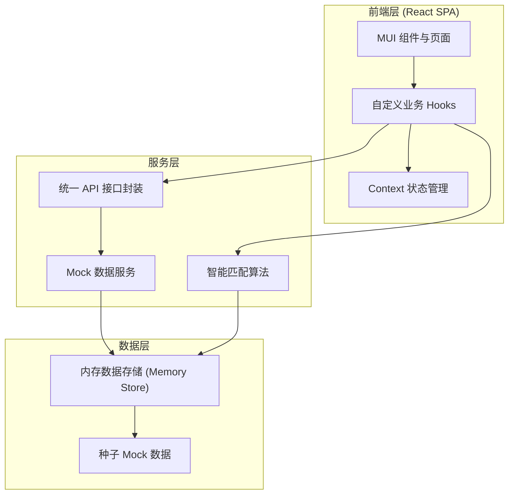
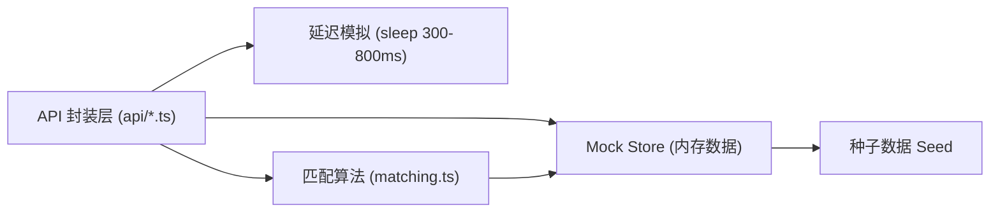
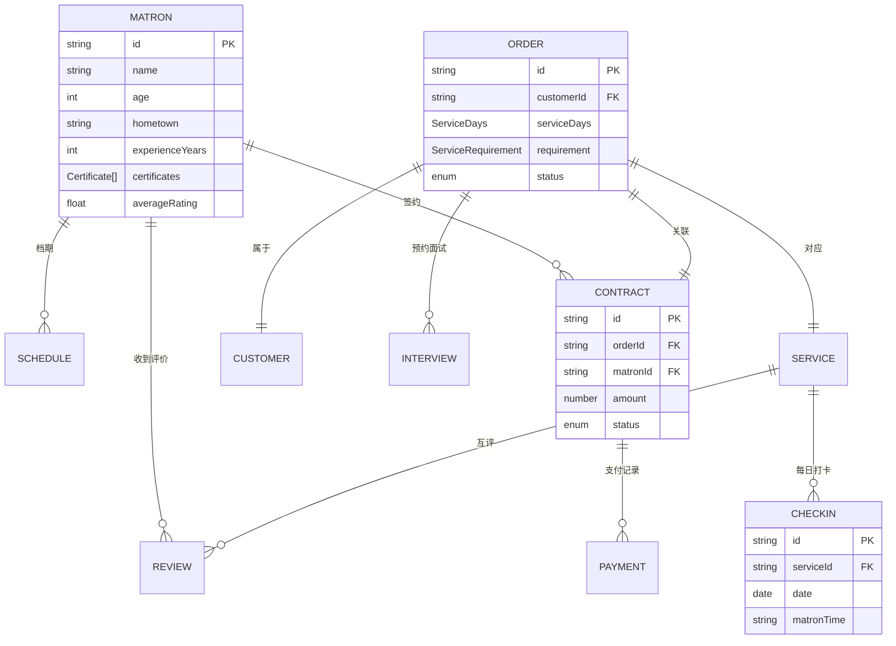

# 月嫂中介公司管理面板 技术架构文档

## 1. 架构设计



**架构说明**：纯前端单页应用，不依赖后端服务。数据层使用内存存储 + 种子数据模拟数据库；服务层封装统一 API 接口与匹配算法；前端层通过 Context + Hooks 消费数据，与 UI 解耦。

## 2. 技术说明

- **前端框架**：React 18 + TypeScript 5（用户指定）
- **UI 组件库**：Material-UI (MUI) v5（用户指定，替代默认 Tailwind 方案）
- **构建工具**：Vite 5
- **路由**：React Router v6
- **状态管理**：Context API + 自定义 Hooks（轻量方案，满足需求且无需引入 Redux 复杂度）
- **图标**：@mui/icons-material
- **日期处理**：date-fns（轻量日期库，用于预产期、档期、服务天数计算）
- **Mock 服务**：自建内存 Store + 模拟延迟的 Promise 封装，模拟真实 API 请求/响应/加载态
- **字体**：通过 `@fontsource` 引入 Noto Serif SC / Noto Sans SC
- **初始化工具**：vite 脚手架 `npm create vite@latest`

## 3. 路由定义

| 路由 | 用途 |
|------|------|
| `/dashboard` | 仪表盘概览（默认首页，重定向 `/` → `/dashboard`） |
| `/matrons` | 月嫂档案列表（筛选/排序/增删改查） |
| `/matrons/:id` | 月嫂档案详情（证书/评价/档期） |
| `/orders` | 订单列表 |
| `/orders/new` | 客户下单表单 |
| `/matching/:orderId` | 智能匹配结果与面试预约 |
| `/contracts` | 合同列表 |
| `/contracts/:id` | 电子合同详情与签署 |
| `/payments` | 支付管理（定金/尾款） |
| `/service/:orderId` | 服务进度跟踪与打卡 |
| `/checkin` | 月嫂端签到面板 |

## 4. API 定义

统一响应格式：`{ code: number; data: T; message: string }`，模拟延迟返回 Promise。

```typescript
// 月嫂
interface Matron {
  id: string;
  name: string;
  age: number;
  hometown: string;          // 籍贯
  experienceYears: number;  // 从业年限
  phone: string;
  avatar: string;
  certificates: Certificate[];  // 持证情况
  schedules: Schedule[];         // 已占用档期
  reviews: Review[];            // 客户评价
  averageRating: number;         // 自动计算均分
  status: 'available' | 'busy' | 'off';
}

type Certificate =
  | 'senior_maternal_care'  // 高级母婴护理师证
  | 'lactation'              // 催乳师证
  | 'nutritionist'           // 营养师证
  | 'pediatric_tuina';       // 小儿推拿证

interface Schedule { orderId: string; startDate: string; endDate: string; }

interface Review {
  id: string;
  matronId: string;
  orderId: string;
  reviewerType: 'customer' | 'matron';
  rating: number;   // 1-5
  comment: string;
  createdAt: string;
}

// 客户与订单
interface Customer { id: string; name: string; phone: string; expectedDeliveryDate: string; }

type ServiceDays = 26 | 42 | 52 | 78;
interface ServiceRequirement {
  lactation: boolean;      // 是否需通乳
  confinementMeal: boolean;// 月子餐制作
  nightCare: boolean;       // 夜间带睡
  housework: boolean;       // 家务兼做
}

interface Order {
  id: string;
  customer: Customer;
  serviceDays: ServiceDays;
  startDate: string;
  endDate: string;          // 由 serviceDays 计算
  requirement: ServiceRequirement;
  status: 'matching' | 'matched' | 'contracted' | 'in_service' | 'completed';
  matchedMatronIds: string[];
  selectedMatronId?: string;
  createdAt: string;
}

// 合同与支付
interface Contract {
  id: string;
  orderId: string;
  matronId: string;
  amount: number;
  deposit: number;         // 定金
  status: 'draft' | 'signed' | 'deposit_paid' | 'final_settled';
  signedAt?: string;
}

interface Payment {
  id: string;
  contractId: string;
  type: 'deposit' | 'final';
  amount: number;
  method: 'wechat' | 'alipay' | 'bank' | 'cash';
  status: 'pending' | 'paid';
  paidAt?: string;
}

// 视频面试预约
interface Interview {
  id: string;
  orderId: string;
  matronId: string;
  scheduledAt: string;
  status: 'pending' | 'done' | 'cancelled';
}

// 打卡
interface Checkin {
  id: string;
  orderId: string;
  matronId: string;
  date: string;
  matronTime?: string;     // 月嫂签到时间
  adminConfirmedAt?: string;
}
```

## 5. 服务端架构图

本项目为纯前端 Mock 架构，无真实后端。Mock 服务层结构如下：



## 6. 数据模型

### 6.1 数据模型定义



### 6.2 数据定义语言

本项目无真实数据库，使用 TypeScript 接口定义数据结构（见第 4 节 API 定义），Mock 数据以 JSON 形式预置在 `src/services/mock/seed.ts` 中，启动时载入内存 Store。关键种子数据包括：

- **月嫂池**：8-10 名月嫂，覆盖不同籍贯、从业年限、证书组合与评价分布
- **订单**：3-5 笔处于不同状态（待匹配/进行中/已完成）的订单
- **合同与支付**：对应订单的合同与支付记录
- **评价**：每名月嫂 2-4 条历史评价，确保均分可计算

## 7. 智能匹配算法说明

匹配算法分三阶段执行（`src/services/matching.ts`）：

1. **档期冲突检测**：遍历月嫂 `schedules`，判断订单 `[startDate, endDate]` 与已占用区间是否重叠，剔除冲突月嫂
2. **技能证书匹配度**：将订单 `requirement`（通乳→催乳师证、月子餐→营养师证、夜间带睡→高级母婴护理师证、家务兼做→高级母婴护理师证）映射到所需证书集合，计算 `命中证书数 / 所需证书数` 得匹配率
3. **评价均分排序**：按 `averageRating` 降序，结合匹配度加权（匹配度优先，同匹配度按评价分），取 Top3

输出每个候选人的匹配明细：档期可用性、证书命中清单、匹配度百分比、评价均分。
